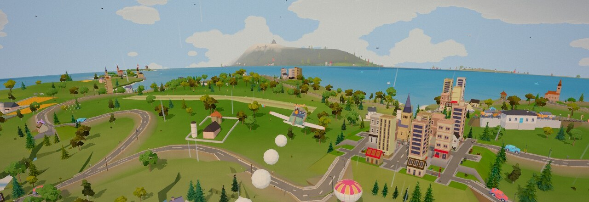
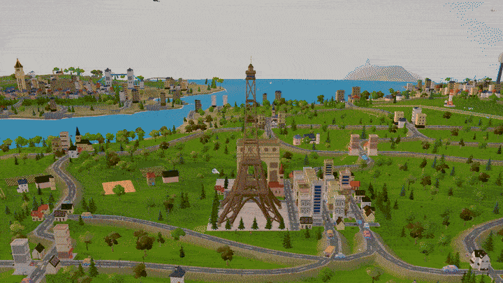
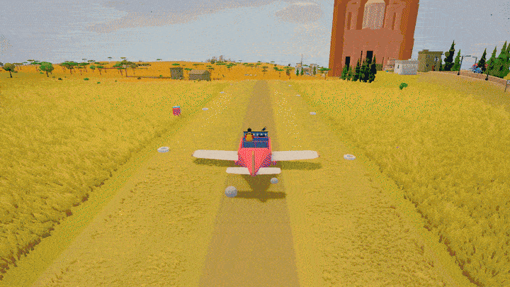
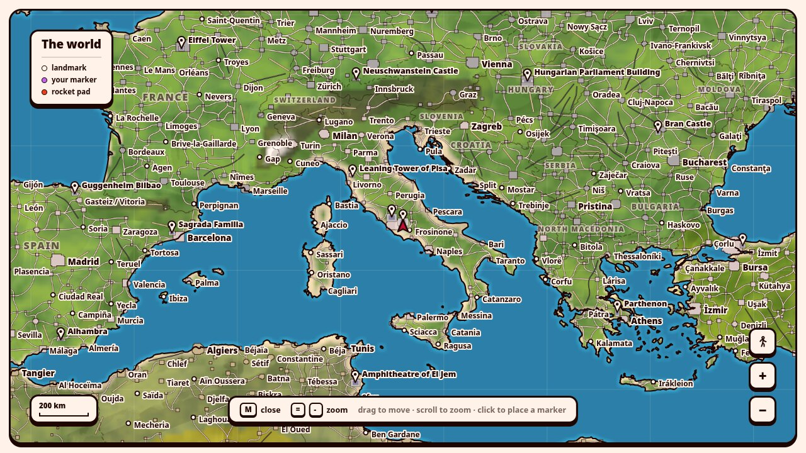
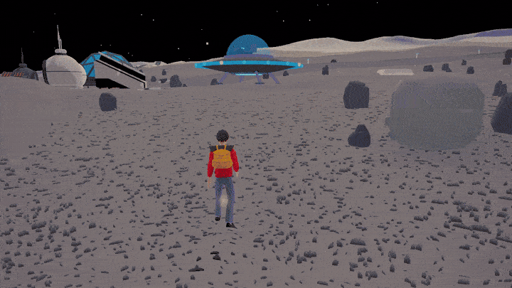

<p align="center">
  
</p>

<p align="center">
  <b>The whole Earth, walkable, in an inked comic style.</b><br>
  Real countries, real towns, 101 landmarks — on foot, by boat, by plane, or by rocket to the Moon.
</p>

<p align="center">
  <a href="https://planeteer.vercel.app"></a>
</p>

<p align="center">
  <a href="https://github.com/andreumassanet/planeteer/actions/workflows/check.yml"></a>
  
  
  
  <a href="LICENSE"></a>
</p>

<p align="center">
  <a href="#getting-around">Getting around</a> ·
  <a href="#the-map">The map</a> ·
  <a href="#the-other-worlds">The other worlds</a> ·
  <a href="#running-it">Running it</a>
</p>

<p align="center">
  
</p>

Planeteer is a browser game about going and looking. The planet is generated
from real data — Natural Earth's coastlines, GeoNames' towns, the real sun — the
same way in every browser, so nothing about the world is sent over the wire.

## Getting around

<p align="center">
  
</p>

**Vehicles stand in the world** — cars, bikes, boats, planes, helicopters, a
horse, a submarine — and <kbd>E</kbd> takes one. Climb high enough and the
world turns into a political map. Online, other travellers share the same
planet.

## The map

<p align="center">
  
</p>

**<kbd>M</kbd> opens the whole planet on one sheet**, drawn from the same data
as the ground, down to every building.

## The other worlds

<p align="center">
  
</p>

**The rest of the solar system can be walked too**, each world under its own
gravity. A rocket beside an airstrip is the way up from Earth.

## How it is made

- **[Three.js](https://threejs.org)** and nothing else at runtime; toon shading
  and an outline pass for the ink.
- **TypeScript + [Vite](https://vite.dev).**
- **Baked data** from Natural Earth and GeoNames, and **CC0 models** for people,
  vehicles and animals. The terrain and every landmark are generated in code.
- **Headless checks** hold the world to its data — that New York is in the
  United States, that no road crosses the sea — and run in CI on every push.

## Running it

Node 22.18 or newer, and pnpm.

```bash
pnpm install
pnpm dev          # http://localhost:5174
pnpm build        # typecheck, then build into dist/
pnpm check        # the world, headless: data, mesh, landmarks, places
```

`?at=lat,lon` skips the menu and lands there.

## Keys

<kbd>W</kbd><kbd>A</kbd><kbd>S</kbd><kbd>D</kbd> move · <kbd>Shift</kbd> run ·
<kbd>Space</kbd> jump · <kbd>E</kbd> drive or talk · <kbd>M</kbd> map ·
<kbd>V</kbd> first person · <kbd>O</kbd> settings, where every key can be rebound.

## Credits

Data from [Natural Earth](https://www.naturalearthdata.com) (public domain) and
[GeoNames](https://www.geonames.org) ([CC BY 4.0](https://creativecommons.org/licenses/by/4.0/)).
Models and sounds by [Kenney](https://kenney.nl), [Quaternius](https://quaternius.com),
Kay Lousberg and CreativeTrio (CC0).

## License

Code under the [MIT License](LICENSE) © 2026 Andreu Massanet. The data and
models in `public/` carry their own terms, listed in [CREDITS.md](CREDITS.md).
